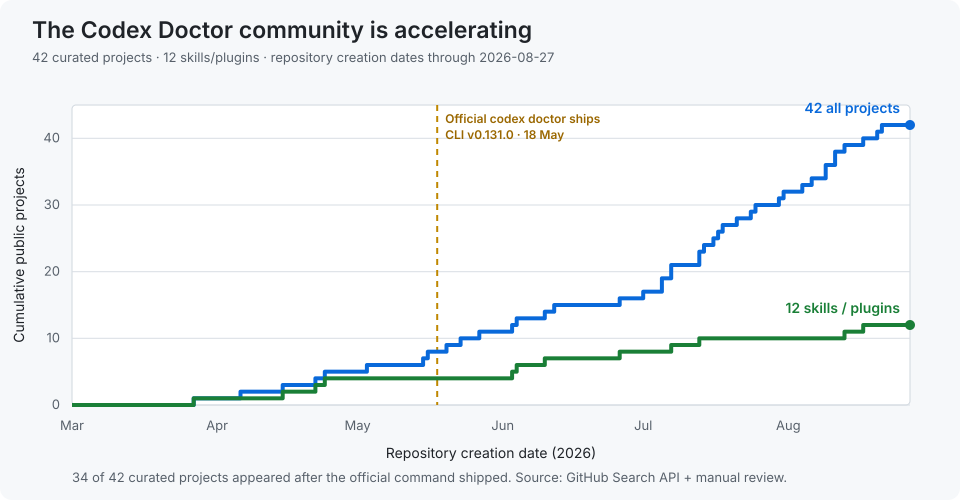

# Awesome Codex Doctors 🩺

> 收集每一位 Codex Doctor，并把它们放在一起比较。

这是一个经过人工复核、以证据为依据的社区目录，收集 OpenAI Codex 的诊断 Skill、修复工具、恢复工具与可观测性项目。

[English](README.md) · [完整目录](CATALOG.md) · [收录方法](METHODOLOGY.md) · [参与贡献](CONTRIBUTING.md)



## 为什么这个社区值得关注

Codex 已经内置了[官方 `codex doctor` 诊断命令](https://github.com/openai/codex/blob/main/codex-rs/cli/src/doctor.rs)，并随 [Codex CLI v0.131.0](https://github.com/openai/codex/releases/tag/rust-v0.131.0) 发布。但社区仍在继续补足通用诊断覆盖不到的专科问题：Windows 环境、Desktop 插件、会话、SQLite 状态、磁盘空间、重连循环、Hooks、MCP、第三方 Provider 和上下文压力等。

截至 2026-08-27，我们从 **51 个名称命中**中人工复核出 **42 个项目**：**38 个核心 Doctor**、**3 个邻近 Doctor 工作流**和 **1 个待核验项目**。其中 **12 个明确采用 Skill 或 Plugin 形态**。42 个项目中有 34 个是在官方命令发布之后出现的。

这条增长曲线说明：Codex 故障诊断正在形成一个社区维护的专业层，而不再只是一个命令。

## 从这里开始

| 项目 | 主要方向 | 形态 | 是否修改本地状态 |
|---|---|---|---:|
| [`openai/codex doctor`](https://github.com/openai/codex/blob/main/codex-rs/cli/src/doctor.rs) | 官方环境与运行时诊断 | 内置 CLI | 否 |
| [`YizeSun/codex-doctor`](https://github.com/YizeSun/codex-doctor) | 运行时存储、缓存和 macOS 构建产物 | Skill + Shell | 可选清理 |
| [`hj01857655/codex-doctor`](https://github.com/hj01857655/codex-doctor) | 会话索引修复与恢复 | Rust CLI + GUI | 是，带备份/预演 |
| [`Maverick04/codex-doctor`](https://github.com/Maverick04/codex-doctor) | 上下文压力、重复工作和慢工具 | Plugin + Node CLI | 否 |
| [`navi118/codex-desktop-doctor-skill`](https://github.com/navi118/codex-desktop-doctor-skill) | Windows Desktop、Chrome 与 Computer Use 故障 | PowerShell Skill | 是 |

完整目录直接嵌入在下方，同时保留独立的 **[CATALOG.md](CATALOG.md)**。

## 按专科快速导航

<!-- quick-links-zh:start -->

- **Desktop 插件修复**: [navi118/codex-desktop-doctor-skill](https://github.com/navi118/codex-desktop-doctor-skill)、[y3078266584/codex-plugin-doctor](https://github.com/y3078266584/codex-plugin-doctor)、[UPmeme/codex-windows-plugin-doctor](https://github.com/UPmeme/codex-windows-plugin-doctor) 等
- **Windows**: [cuijialin8888-code/codex-win-doctor](https://github.com/cuijialin8888-code/codex-win-doctor)、[Yurainln1122/codex-windows-doctor](https://github.com/Yurainln1122/codex-windows-doctor)、[Yaro-Tab/codex-windows-doctor](https://github.com/Yaro-Tab/codex-windows-doctor) 等
- **重连**: [juzai0924-cloud/codex-reconnect-doctor](https://github.com/juzai0924-cloud/codex-reconnect-doctor)、[baixinpan/codex-reconnecting-doctor](https://github.com/baixinpan/codex-reconnecting-doctor) 等
- **会话修复**: [hj01857655/codex-doctor](https://github.com/hj01857655/codex-doctor)、[Nitmi/codex-session-doctor](https://github.com/Nitmi/codex-session-doctor) 等
- **认证**: [Qiyuanqiii/codex-401-doctor](https://github.com/Qiyuanqiii/codex-401-doctor) 等
- **配置**: [Lumidew/codex-doctor](https://github.com/Lumidew/codex-doctor) 等
- **上下文**: [ChenSir886/codex-context-doctor-cn](https://github.com/ChenSir886/codex-context-doctor-cn) 等
- **上下文与 Token**: [ironman429100-rgb/codex-token-doctor](https://github.com/ironman429100-rgb/codex-token-doctor) 等

<!-- quick-links-zh:end -->

## 完整目录

<!-- catalog-zh:start -->

| 项目 | 关注点 | 创建日期 | Stars | 最后提交 |
|---|---|---:|---:|---:|
| [navi118/codex-desktop-doctor-skill](https://github.com/navi118/codex-desktop-doctor-skill) | 面向Desktop 插件修复问题的诊断与修复Skill/插件，用于定位根因并提供处理路径。 | 2026-06-03 | 32 | 2026-07-21 |
| [wokao4360-rgb/codex-desktop-doctor](https://github.com/wokao4360-rgb/codex-desktop-doctor) | 面向Desktop 修复问题的诊断与修复工具，用于定位根因并提供处理路径。 | 2026-05-03 | 12 | 2026-05-03 |
| [2023Anita/codex-speed-doctor](https://github.com/2023Anita/codex-speed-doctor) | 面向性能问题的只读诊断工具，用于定位根因并提供处理路径。 | 2026-05-15 | 5 | 2026-07-19 |
| [cuijialin8888-code/codex-win-doctor](https://github.com/cuijialin8888-code/codex-win-doctor) | 面向Windows问题的诊断工具，用于定位根因并提供处理路径。 | 2026-08-11 | 3 | 2026-08-26 |
| [Esquetta/CodexPluginDoctor](https://github.com/Esquetta/CodexPluginDoctor) | 面向插件验证问题的诊断Skill/插件，用于定位根因并提供处理路径。 | 2026-04-22 | 2 | 2026-08-25 |
| [Qiyuanqiii/codex-401-doctor](https://github.com/Qiyuanqiii/codex-401-doctor) | 面向认证问题的诊断与修复工具，用于定位根因并提供处理路径。 | 2026-07-07 | 2 | 2026-08-06 |
| [RE-Rays/codex-environment-doctor](https://github.com/RE-Rays/codex-environment-doctor) | 面向环境问题的诊断工具，用于定位根因并提供处理路径。 | 2026-08-06 | 1 | 2026-08-06 |
| [Yurainln1122/codex-windows-doctor](https://github.com/Yurainln1122/codex-windows-doctor) | 面向Windows问题的只读诊断工具，用于定位根因并提供处理路径。 | 2026-07-31 | 1 | 2026-07-31 |
| [Gmasterzhangxinyang/codex-doctor](https://github.com/Gmasterzhangxinyang/codex-doctor) | 面向会话健康问题的诊断工具，用于定位根因并提供处理路径。 | 2026-07-01 | 1 | 2026-07-22 |
| [Freyliu0516/Codex-Log-Doctor](https://github.com/Freyliu0516/Codex-Log-Doctor) | 面向日志问题的诊断工具，用于定位根因并提供处理路径。 | 2026-07-13 | 1 | 2026-07-14 |
| [2395115107-stack/codex-history-doctor](https://github.com/2395115107-stack/codex-history-doctor) | 面向历史记录问题的诊断工具，用于定位根因并提供处理路径。 | 2026-05-27 | 1 | 2026-05-28 |
| [Maverick04/codex-doctor](https://github.com/Maverick04/codex-doctor) | 面向会话可观测性问题的诊断Skill/插件，用于定位根因并提供处理路径。 | 2026-04-24 | 1 | 2026-04-25 |
| [hj01857655/codex-doctor](https://github.com/hj01857655/codex-doctor) | 面向会话修复问题的诊断与修复工具，用于定位根因并提供处理路径。 | 2026-04-06 | 1 | 2026-04-08 |
| [RobertIonutF/codex-budget-doctor](https://github.com/RobertIonutF/codex-budget-doctor) | 面向用量与预算问题的诊断工具，用于定位根因并提供处理路径。 | 2026-08-21 | 0 | 2026-08-21 |
| [vik-codex/Doctor](https://github.com/vik-codex/Doctor) | 面向待确认问题的诊断工具，用于定位根因并提供处理路径。 | 2026-08-20 | 0 | 2026-08-20 |
| [yezhouyedu/codex-report-doctor](https://github.com/yezhouyedu/codex-report-doctor) | 面向报告质量问题的诊断Skill/插件，用于定位根因并提供处理路径。 | 2026-08-17 | 0 | 2026-08-17 |
| [y3078266584/codex-plugin-doctor](https://github.com/y3078266584/codex-plugin-doctor) | 🩺 修复 Codex Windows 端 openai-bundled 插件（Browser/Chrome/Computer Use）不可用的 Codex Skill | 2026-08-13 | 0 | 2026-08-13 |
| [DWG7318/codex-network-doctor](https://github.com/DWG7318/codex-network-doctor) | 面向网络问题的诊断与修复工具，用于定位根因并提供处理路径。 | 2026-07-30 | 0 | 2026-08-13 |
| [xiangyanghua-22/codex-hooks-doctor](https://github.com/xiangyanghua-22/codex-hooks-doctor) | 面向Hooks问题的诊断工具，用于定位根因并提供处理路径。 | 2026-08-11 | 0 | 2026-08-13 |
| [Yaro-Tab/codex-windows-doctor](https://github.com/Yaro-Tab/codex-windows-doctor) | 面向Windows问题的只读诊断工具，用于定位根因并提供处理路径。 | 2026-08-09 | 0 | 2026-08-09 |
| [momochoog/codex-workspace-doctor](https://github.com/momochoog/codex-workspace-doctor) | 面向工作区存储问题的只读诊断工具，用于定位根因并提供处理路径。 | 2026-08-09 | 0 | 2026-08-09 |
| [wildbyteai/codex-provider-doctor](https://github.com/wildbyteai/codex-provider-doctor) | 面向模型 Provider问题的只读诊断工具，用于定位根因并提供处理路径。 | 2026-08-04 | 0 | 2026-08-06 |
| [YizeSun/codex-doctor](https://github.com/YizeSun/codex-doctor) | 面向运行时存储问题的诊断与清理Skill/插件，用于定位根因并提供处理路径。 | 2026-07-07 | 0 | 2026-07-25 |
| [Lumidew/codex-doctor](https://github.com/Lumidew/codex-doctor) | 面向配置问题的诊断工具，用于定位根因并提供处理路径。 | 2026-07-25 | 0 | 2026-07-25 |
| [BTCElectrician/codex-storage-doctor](https://github.com/BTCElectrician/codex-storage-doctor) | 面向SQLite 存储问题的诊断工具，用于定位根因并提供处理路径。 | 2026-07-24 | 0 | 2026-07-25 |
| [gtrgear/codex-submission-doctor](https://github.com/gtrgear/codex-submission-doctor) | 面向提交预检问题的诊断工具，用于定位根因并提供处理路径。 | 2026-07-21 | 0 | 2026-07-21 |
| [luogangan7-lgtm/codex-mcp-doctor](https://github.com/luogangan7-lgtm/codex-mcp-doctor) | 面向MCP问题的诊断工具，用于定位根因并提供处理路径。 | 2026-07-18 | 0 | 2026-07-19 |
| [configcrate/codex-session-doctor](https://github.com/configcrate/codex-session-doctor) | 面向会话完整性问题的只读诊断工具，用于定位根因并提供处理路径。 | 2026-07-17 | 0 | 2026-07-17 |
| [zjp1997720/codex-doctor](https://github.com/zjp1997720/codex-doctor) | 面向工作区配置问题的只读诊断工具，用于定位根因并提供处理路径。 | 2026-07-14 | 0 | 2026-07-17 |
| [warren2008-2020-spec/codex-doctor](https://github.com/warren2008-2020-spec/codex-doctor) | 面向安装与配置问题的只读诊断工具，用于定位根因并提供处理路径。 | 2026-07-16 | 0 | 2026-07-16 |
| [junchangzhu42-eng/codex-skill-doctor](https://github.com/junchangzhu42-eng/codex-skill-doctor) | 面向Skill 恢复问题的诊断与修复Skill/插件，用于定位根因并提供处理路径。 | 2026-07-13 | 0 | 2026-07-13 |
| [juzai0924-cloud/codex-reconnect-doctor](https://github.com/juzai0924-cloud/codex-reconnect-doctor) | 面向重连问题的诊断工具，用于定位根因并提供处理路径。 | 2026-07-05 | 0 | 2026-07-06 |
| [shixianli083-eng/codex-doctor](https://github.com/shixianli083-eng/codex-doctor) | 面向macOS 环境问题的诊断工具，用于定位根因并提供处理路径。 | 2026-07-05 | 0 | 2026-07-05 |
| [leiJack-lo/codex-local-doctor-skill](https://github.com/leiJack-lo/codex-local-doctor-skill) | 面向本地状态问题的诊断Skill/插件，用于定位根因并提供处理路径。 | 2026-06-26 | 0 | 2026-06-26 |
| [ember056/codex_session_doctor](https://github.com/ember056/codex_session_doctor) | 面向会话恢复问题的诊断与修复工具，用于定位根因并提供处理路径。 | 2026-06-12 | 0 | 2026-06-12 |
| [baixinpan/codex-reconnecting-doctor](https://github.com/baixinpan/codex-reconnecting-doctor) | 面向重连问题的诊断与修复Skill/插件，用于定位根因并提供处理路径。 | 2026-06-10 | 0 | 2026-06-10 |
| [UPmeme/codex-windows-plugin-doctor](https://github.com/UPmeme/codex-windows-plugin-doctor) | 面向Desktop 插件修复问题的诊断与修复Skill/插件，用于定位根因并提供处理路径。 | 2026-06-04 | 0 | 2026-06-04 |
| [ironman429100-rgb/codex-token-doctor](https://github.com/ironman429100-rgb/codex-token-doctor) | 面向上下文与 Token问题的诊断工具，用于定位根因并提供处理路径。 | 2026-05-20 | 0 | 2026-05-25 |
| [ChenSir886/codex-context-doctor-cn](https://github.com/ChenSir886/codex-context-doctor-cn) | 中文 Codex 上下文配置体检工具，检查自动压缩阈值和模型窗口 | 2026-05-23 | 0 | 2026-05-23 |
| [Nitmi/codex-session-doctor](https://github.com/Nitmi/codex-session-doctor) | 面向会话修复问题的诊断与修复工具，用于定位根因并提供处理路径。 | 2026-05-16 | 0 | 2026-05-16 |
| [daniel-p-green/codex-skill_secret-agents-dot-md-doctor](https://github.com/daniel-p-green/codex-skill_secret-agents-dot-md-doctor) | 面向AGENTS.md问题的诊断Skill/插件，用于定位根因并提供处理路径。 | 2026-04-15 | 0 | 2026-04-15 |
| [warwickmei/codex-skill-doctor](https://github.com/warwickmei/codex-skill-doctor) | 面向Skill 诊断问题的诊断Skill/插件，用于定位根因并提供处理路径。 | 2026-03-27 | 0 | 2026-03-27 |

<!-- catalog-zh:end -->

## 仓库自带 Skills

| Skill | 用途 |
|---|---|
| [`$codex-doctor`](skills/codex-doctor/SKILL.md) | 先定义 Codex 问题，优先搜索本地证据和本目录，再核验官方与社区来源，最后按风险给出诊断路线。 |
| [`$update-awesome-codex-doctors`](skills/update-awesome-codex-doctors/SKILL.md) | 发现、核验、分类、生成并审计目录变更，让贡献达到可审查、可合并状态。 |

可以把任一目录作为普通 Codex Skill 安装，也可以在能够发现仓库 Skills 的工作副本中直接使用。诊断 Skill 默认只读；维护 Skill 默认只修改本目录，不会擅自提交、推送或合并。

## 收录范围

项目必须能够诊断、解释、监控、修复或安全缓解 OpenAI Codex 的问题。内置命令、CLI、GUI、Skill 和 Plugin 都可以收录。仅仅使用 Codex 开发的医疗应用、测试仓库，以及只因作者用户名带有 doctor 而命中的项目不收录。

每条记录都会标注专科和范围。只读诊断、修复与清理属于不同风险等级；被收录不代表得到背书。

## 仓库介绍与关键词

**GitHub 简介：**

> 收集、分类并持续验证 Codex 诊断、修复、恢复与可观测性工具。

**建议 Topics：**

`awesome-list` · `codex` · `codex-cli` · `codex-doctor` · `openai-codex` · `codex-skills` · `agent-skills` · `plugins` · `diagnostics` · `troubleshooting` · `repair` · `recovery` · `observability` · `developer-tools`

## 数据与更新

当前数据快照位于 [`data/github-snapshot.json`](data/github-snapshot.json)，机器可读导出位于 [`data/catalog.json`](data/catalog.json)。运行：

```bash
python scripts/discover.py
python scripts/render.py
python scripts/render.py --check
```

`discover.py` 用于拉取待人工复核候选，`render.py` 重新生成目录/曲线/导出，`--check` 供 CI 检查生成文件是否过期。

## 免责声明

这是独立的社区目录，与 OpenAI 无隶属或背书关系。允许任何第三方 Doctor 修改 `~/.codex` 或其他本地状态前，请先阅读代码并确认备份。

## 许可证

CC0-1.0。项目描述和链接指向的源代码仍适用各自原始许可证。
